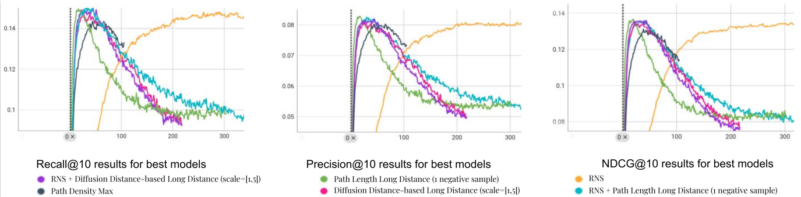

# Enhancing Recommendation Systems with Novel Negative Sampling Techniques

## Abstract
Recommendation systems struggle with data sparsity and class imbalance hindering their ability to recommend relevant items. An efficient solution to these problems is negative sampling. Existing approaches cover static, hard, or GAN-based negative samplings. This study proposes novel negative sampling techniques leveraging the rich structure of the bipartite network of user-item interactions. We introduce ten novel negative sampling methods by exploiting three network topology-favored strategies: Path-Length Negative Sampling (PL-NS), Path-Density Negative Sampling (PD-NS), and Diffusion Distance Negative Sampling (DD-NS). Our aim is to identify more challenging negative examples and refine the learning process of Graph Convolutional Network (GCN) based recommender systems. The proposed methods are integrated into the LightGCN framework and evaluated on the Last.fm dataset. Results show improvements in key performance metrics (Precision@10, Recall@10, NDCG@10) compared to two well-known static sampling baselines, uniform random and popularity-based negative sampling. Our best-performing approach achieves up to 6% improvement in Precision@10 and 7% in NDCG@10. Additionally, all of these strategies accelerate model convergence, reducing training time by up to 30-35%.

## Results
### Key Performance Metrics
| Method                 | #Neg Item per Pos Item | Precision@10 | Recall@10 | NDCG@10 |
|------------------------|------------------------|--------------|-----------|---------|
| Uniform Random Sampling|           1            |    0.0811    |   0.1483  | 0.1347  |
| Popularity-based NS    |           1            |    0.079     |   0.1435  | 0.1295  |
| RNS+PL-Long-Distance   |           1            |    0.0827    |   0.1511  | 0.1361  |
| PL-Long-Distance       |           2            |    0.0828    |   0.1498  | 0.1368  |
| PD-Min                 |           1            |    0.0804    |   0.1437  | 0.1314  |
| DD-NS-Long-Distane     |           1            |    0.083     |   0.1515  | 0.1382  |
|**RNS+DD-NS-Long-Distance**|      **1**          |  **0.0836**  | **0.1536**|**0.1386**|

### Performance Curves

*Figure: Precision, Recall, and NDCG Curves for Different Negative Sampling Methods*

## Repository Structure
- `data/`: Contains the Last.fm dataset and any other necessary data files.
- `code/utils.py`: Contains the implementation of our novel negative sampling strategies.
- `code/sources/`: Contains the R script for calculating diffusion distance.

## Usage
We have integrated our proposed negative sampling methods into the official LightGCN code.

### Negative Sampling Strategies

In our project, we provide several negative sampling strategies that can be specified using the `--neg_samp_strategy` flag. Each strategy is designed to address different aspects of data sparsity and class imbalance in recommender systems. Below are the available options and their corresponding methods:

#### Commute Distance

This strategy uses the diffusion distance negative sampling approach. The available options within this strategy are:

- **farthest**: Selects the farthest items based on commute distance.
- **nearest**: Selects the nearest items based on commute distance.
- **q1**: Uses the first quartile (Q1) for selection, focusing on closer items.
- **q2**: Uses the second quartile (Q2) for selection, focusing on moderately distant items.
- **scaled**: Refers to the long-distance strategy within the commute distance approach.

#### Naive Random Walk

This strategy utilizes the path length negative sampling approach. The available options within this strategy are:

- **normal**: Refers to the long-distance strategy in the path length approach.
- **q1**: Uses the first quartile (Q1) for selection, focusing on shorter paths.
- **q2**: Uses the second quartile (Q2) for selection, focusing on moderately long paths.

#### All Simple Paths

This strategy is based on the path density negative sampling approach. It calculates the density of all simple paths between nodes to determine negative samples.
- **num_path**: Refers to the minimum strategy, focusing on items with the least number of paths.
- **max_path**: Refers to the maximum strategy, focusing on items with the highest number of paths.


#### Alpha75

This strategy uses the popularity-based negative sampling approach. The available options within this strategy are:


#### Combining with Random Negative Sampling (RNS)

If the `add_randomness` flag is set to 1, the results from the above strategies will be combined with Random Negative Sampling (RNS) to introduce an element of randomness and further diversify the negative examples.

#### Sample Running Script for Diffusion Distance Negative Sampling
To specify a negative sampling strategy, use the `--neg_samp_strategy` flag followed by the desired option
Using the following script, one can try path length ns (--neg_sample="naive_random_walk") using long distance weighted strategy (--neg_samp_strategy='scaled').
```bash
python main.py --decay=1e-4 --lr=0.001 --layer=3 --seed=2020 --dataset="lastfm" --topks="[10]" --recdim=64 --neg_sample="naive_random_walk" --multicore=1 --positem=10 --negitem=1 --add_randomness=0 --neg_samp_strategy='scaled'
```

Using the following script, one can try diffusion distance ns (--neg_sample="commute_distance") using long distance weighted strategy (--neg_samp_strategy='scaled').
```bash
python main.py --decay=1e-4 --lr=0.001 --layer=3 --seed=2020 --dataset="lastfm" --topks="[10]" --recdim=64 --neg_sample="commute_distance" --multicore=1 --positem=10 --negitem=1 --add_randomness=0 --neg_samp_strategy='scaled' --commute_matrix_path='../data/lastfm/...'
```

Diffusion distance is calculated using the R script located in `LightGCN-PyTorch/code/sources/hitting_time_calculate.R`, and the resulting distance is saved into the `commute_matrix_path`.


#### General Steps
1. **Clone the repository:**
   ```bash
   git clone https://github.com/yourusername/your-repo-name.git
   cd your-repo-name
   ```
2. **Install dependencies:**
   ```bash
   cd LightGCN-PyTorch/
   pip install -r requirements.txt
   ```
3. **Calculate Diffusion Distance (if applicable):**
   Run the R script `hitting_time_calculate.R` to compute diffusion distances and save them into the specified path.
4. **Run the model:**
   ```bash
   cd LightGCN-PyTorch/code/
   python main.py 


## Acknowledgements
This work is supported by the Galatasaray University Research Fund (BAP) within the scope of project number FBA-2024-1240, titled *Bağlantı Tahmini Yöntemleri ve Sınıf Dengesizliği Sorununa Çözüm Yaklaşımları*, and the bilateral project of the Scientific and Technological Research Council of Türkiye (TÜBITAK), under grant number 122N701, with CampusFrance, within the scope of Hubert Curien Partnerships (PHC) project number 49032VB.
